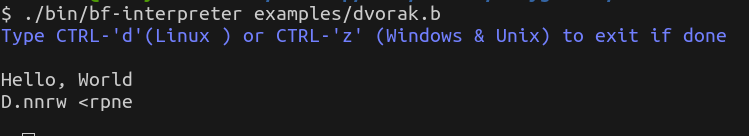

# Brainfuck Interpreter in C++
This is a simple interpreter for the [brainf*ck](https://en.wikipedia.org/wiki/Brainfuck) [esoteric programming language](https://en.wikipedia.org/wiki/Esoteric_programming_language) written in C++.  
I have provided example brainf\*ck files (ending in .b) in case you want to test this interpreter but don't know anything about the language.  

So, something like:  
  

I plan to write a compiler also, so stay tuned for that.  
This project and all future brainf\*ck projects are just for fun and used as a challenge to better my programming. Essentially, I am saying do not expect much from them
